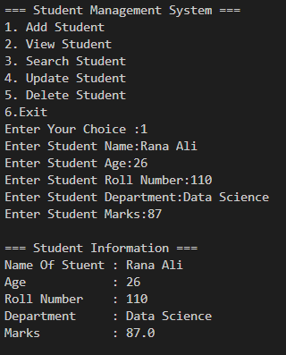

# 🎓 Student Management System

> A beginner-friendly Python project demonstrating clean code organization using Object-Oriented Programming, modular design, file handling, and exception handling.

A professional command-line Student Management System developed in **Python** using **Object-Oriented Programming (OOP)**, **Modules**, **Packages**, **File Handling**, and **Exception Handling**.

---

# 🚀 Features

- ✅ Add Student
- ✅ View Students
- ✅ Search Student
- ✅ Update Student
- ✅ Delete Student
- ✅ File Handling
- ✅ Exception Handling
- ✅ Modular Project Structure

---

# 🛠 Technologies Used

- Python 3
- Object-Oriented Programming (OOP)
- Modules
- Packages
- File Handling
- Exception Handling
- Visual Studio Code
- Git & GitHub

---

# 📂 Project Structure

```text
Student-Management-System/

│── Student/
│── Operations/
│── Utility/
│── Files/
│── main.py
│── requirements.txt
│── README.md
│── .gitignore
```

---

# ▶️ How To Run

### Clone Repository

```bash
git clone <repository-url>
```

### Open Project

```bash
cd Student-Management-System
```

### Create Virtual Environment

```bash
python -m venv .venv
```

### Activate Virtual Environment

Windows

```bash
.venv\Scripts\Activate.ps1
```

### Install Requirements

```bash
pip install -r requirements.txt
```

### Run Project

```bash
python main.py
```

---

# 📸 Project Preview

# 📸 Project Preview

## 🏠 Main Menu

## 📸 Project Preview

### 🏠 Main Menu


### ➕ Add Student



### 📋 View Student


### 🔍 Search Student


### ✏️ Update Student


### 🗑️ Delete Student


# 👨‍💻 Author

**Muhammad Awais Raza**

Bachelor of Computer Science

Learning AI Engineering & Software Development

GitHub:
(https://github.com/MuhammadAwais08/Student-Management-System.git)
